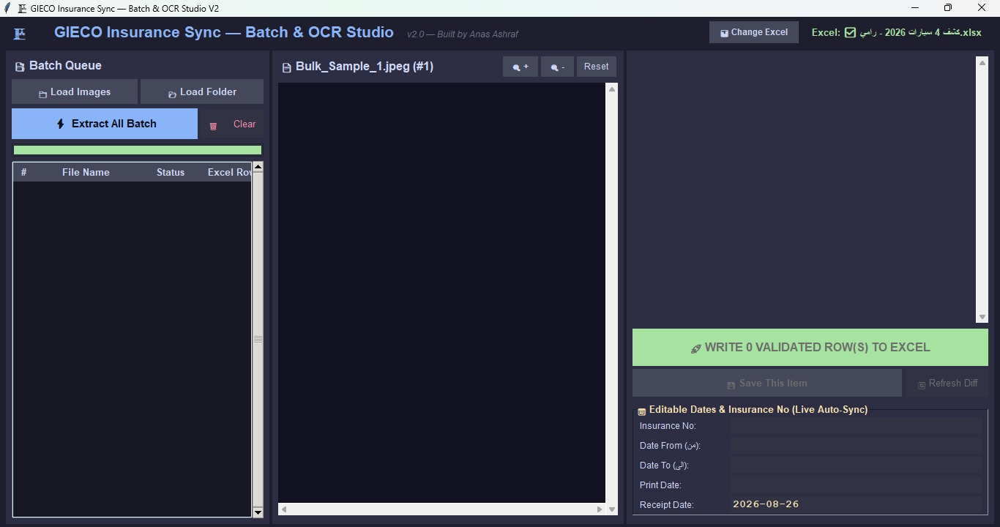
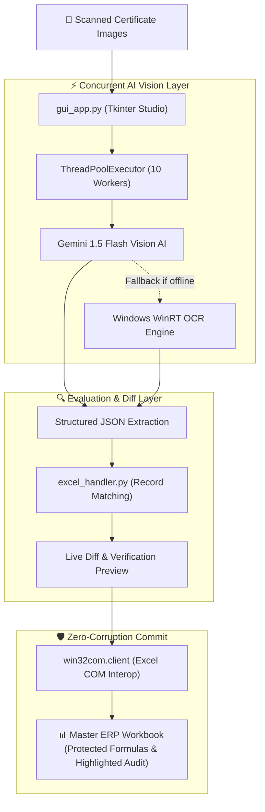

<div align="center">

# AI Excel Bridge

### Gemini Vision AI + Native Excel COM Integration for Batch Document Automation


**Turns a 45-minute manual data-entry task into a 5-second automated batch process with zero formula corruption.**

---



</div>

---

## 📌 The Problem

HR and Fleet Operations teams regularly receive batches of photographed Arabic vehicle insurance certificates that must be transcribed into master ERP Excel workbooks.
- **Time Sink:** 45+ minutes per batch of 15–20 physical documents.
- **Human Error:** High risk of transcription errors on numeric identifiers (national IDs, insurance numbers, chassis codes).
- **ERP Formula Corruption:** Standard Python Excel libraries (such as `openpyxl`) strip out external links, complex array formulas, and VBA macros upon saving.

## 💡 The Solution

A high-throughput desktop application powered by **Google Gemini Vision AI** and **Native Windows Excel COM Interop**:
1. **Concurrent Multimodal OCR:** Dispatches batches in parallel using `ThreadPoolExecutor` to extract structured JSON data.
2. **Zero-Corruption Writing:** Drives the native Microsoft Excel application via COM (`win32com.client`), guaranteeing 100% preservation of macros, conditional formats, and dynamic formulas.
3. **Soft-Audit Verification:** Automatically highlights updated cells and rows in yellow for effortless supervisor audit.

---

## ✨ Key Features

| Feature | Description |
|---|---|
| ⚡ **Concurrent AI Extraction** | Dispatches up to 10 images simultaneously to Gemini 1.5 Flash Vision AI, achieving a **10x speedup** over sequential OCR. |
| 🛡️ **Zero Formula Corruption** | Interacts directly with Excel COM objects silently in the background—macros and cross-sheet formulas remain 100% intact. |
| 🔍 **Live Side-by-Side Diff** | Interactive side-by-side view comparing extracted fields with current Excel records before committing. |
| 🎨 **Visual Audit Trail** | Modified rows and cells receive soft-audit color highlighting for instant supervisor validation. |
| 📅 **Smart Batch Date Sync** | Modifying a delivery receipt date instantly synchronizes across all queued items in the batch. |
| 🔄 **Dual OCR Failover** | High-precision Gemini Vision AI with automatic fallback to Windows native WinRT OCR when offline. |
| 📦 **Portable Standalone EXE** | Packaged via PyInstaller into a standalone executable running directly on any Windows workstation. |

---

## 🏗️ System Architecture



---

## 🛠️ Tech Stack

- **GUI Studio:** Python Tkinter (Custom dark theme with scrollable zoom canvas)
- **Multimodal AI:** Google Gemini 1.5 Flash (`google-genai` SDK)
- **Image Processing:** OpenCV, Pillow
- **Excel Interop:** `pywin32` / `win32com.client`
- **Fallback OCR:** Windows WinRT Media OCR
- **Packaging:** PyInstaller

---

## 🚀 Quick Start

> **Prerequisite:** Windows 10/11 with Microsoft Excel installed (for COM interop layer).

### 1. Clone the Repository
```bash
git clone https://github.com/Anas9906/ai-excel-bridge.git
cd ai-excel-bridge
```

### 2. Install Dependencies
```bash
pip install -r requirements.txt
```

### 3. Configure API Key
Copy the `.env.example` file to `.env`:
```bash
cp .env.example .env
```
Add your free Gemini API key from [Google AI Studio](https://aistudio.google.com/):
```env
GEMINI_API_KEY=your_actual_api_key_here
```

### 4. Launch the Studio
```bash
python gui_app.py
```

### 5. Build Standalone Executable (.exe)
```bash
python build_exe.py
```

---

## 📖 Engineering Journey

For a transparent record of the architectural decisions, failed approaches (including why `openpyxl` was abandoned for COM), and concurrency benchmarks, read **[ENGINEERING_JOURNEY.md](ENGINEERING_JOURNEY.md)**.

---

## 📄 License

This project is licensed under the MIT License — see the [LICENSE](LICENSE) file for details.
